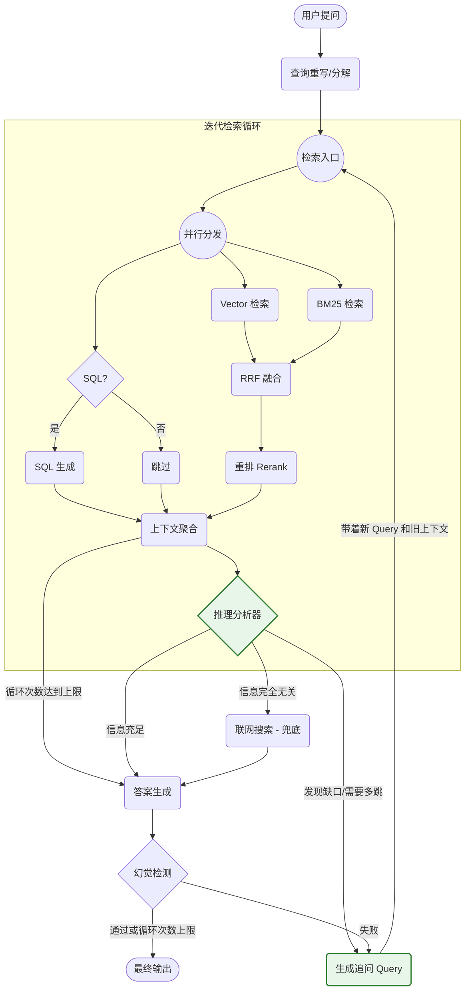

# RAG Agent

基于 LangGraph 的智能检索增强生成系统，支持多跳推理和幻觉检测。

## 核心特性

- **混合检索**：SQL路由 + 向量检索(Milvus) + BM25关键词检索，RRF融合 + 语义重排序(Qwen3-Reranker)
- **多跳推理**：基于LangGraph状态机的迭代检索与推理分析
- **幻觉检测**：检测并修正生成内容中的幻觉信息
- **联网搜索**：信息不足时自动触发Tavily外部搜索
- **多模态支持**：文本、表格、结构化数据统一处理
- **流式输出**：实时流式问答响应，支持引用标注

## 技术栈

- **框架**：LangGraph + LangChain
- **模型**：DeepSeek Chat、Qwen3-Embedding、Qwen3-Reranker
- **检索**：Milvus(向量) + BM25(关键词) + SQLite(结构化)
- **搜索**：Tavily (联网搜索)

## 快速开始

### 环境配置

```bash
# 安装依赖
pip install -r requirements.txt

# 配置环境变量 .env
DEEPSEEK_API_KEY=your_key
TAVILY_API_KEY=your_key
OLLAMA_BASE_URL=http://localhost:11434
```

### 命令行使用

```bash
# 单次问答
python -m rag_agent.cli "问题"

# 交互模式
python -m rag_agent.cli

# 调试模式
python -m rag_agent.cli "问题" --debug

# 批量问答
python -m rag_agent.cli --input questions.txt --output answers.jsonl
```

### Web 界面

```bash
# 启动Web服务
uvicorn web_server:app --host 0.0.0.0 --port 8000

# 浏览器访问
http://localhost:8000
```

### Python API

```python
from rag_agent import RagAgent

agent = RagAgent()

# 标准问答
answer = agent.run("问题")
print(answer.text)

# 流式问答
stream, citations = agent.run_stream("问题")
for chunk in stream:
    print(chunk, end="", flush=True)
```

## 架构设计

### 总览



### 检索流程

```
查询重写 → 并行检索(Vector + BM25 + SQL) → RRF融合 → 重排序 → 上下文聚合
```

### 推理流程

```
推理分析 → 信息充分性判断 → { 答案生成 | 追问检索 | 联网搜索 } → 幻觉检测 → 最终输出
```

## 目录结构

```
rag_agent/
├── core/           # 核心状态机与类型定义
├── retrieval/      # 混合检索引擎
├── generation/     # 答案生成
├── grade/          # 推理分析与幻觉检测
├── query/          # 查询改写与追问生成
├── llm/            # LLM服务封装
└── config/         # 配置管理
```

## 配置说明

关键参数见 `.env` 文件：

- `RESPONSE_MODEL`: 生成模型名称(默认: deepseek-chat)
- `TOP_K_RETRIEVAL`: 检索文档数量(默认: 8)
- `RERANKER_MODEL`: 重排模型路径
- `USE_MMR`: 启用最大边际相关性(默认: true)

## License

MIT